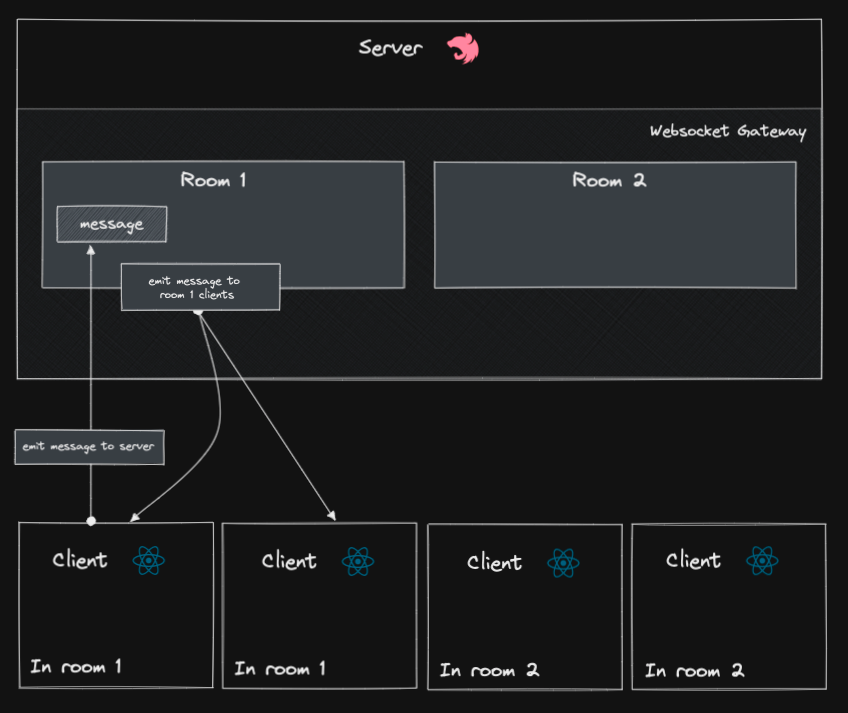

## Description

> This is a realtime chat application built with NestJS, React and Socket.io. Nest provides support out of the box for websockets via Socket.io while we're using a Socket.io client in the React application. Users can login and create or join existing chat rooms!

## Design



### Server

- Chat websocket [gateway](https://docs.nestjs.com/websockets/gateways).
- Object schema validation via [pipes](https://docs.nestjs.com/pipes) with [zod](https://github.com/colinhacks/zod).
- Attribute-based access control authorization via [guards](https://docs.nestjs.com/guards) with [CASL](https://casl.js.org/v6/en).

### Client

- Socket.io client to interact with the server through websockets.
- Client/server state management with [Tanstack Query](https://tanstack.com/query/v4).
- CSS styling with [tailwindcss](https://tailwindcss.com/).
- Client-side routing with [Tanstack Location](https://react-location.tanstack.com/).
- Forms with [react-hook-form](https://react-hook-form.com/).
- Object schema validation for events, forms, and more with [zod](https://github.com/colinhacks/zod).

## Installation

```bash
$ yarn
```

## Running the app

```bash
# start client and server in development mode
$ yarn dev

# build client and server for production
$ yarn build

# start server in production
$ yarn start:prodserver
```
